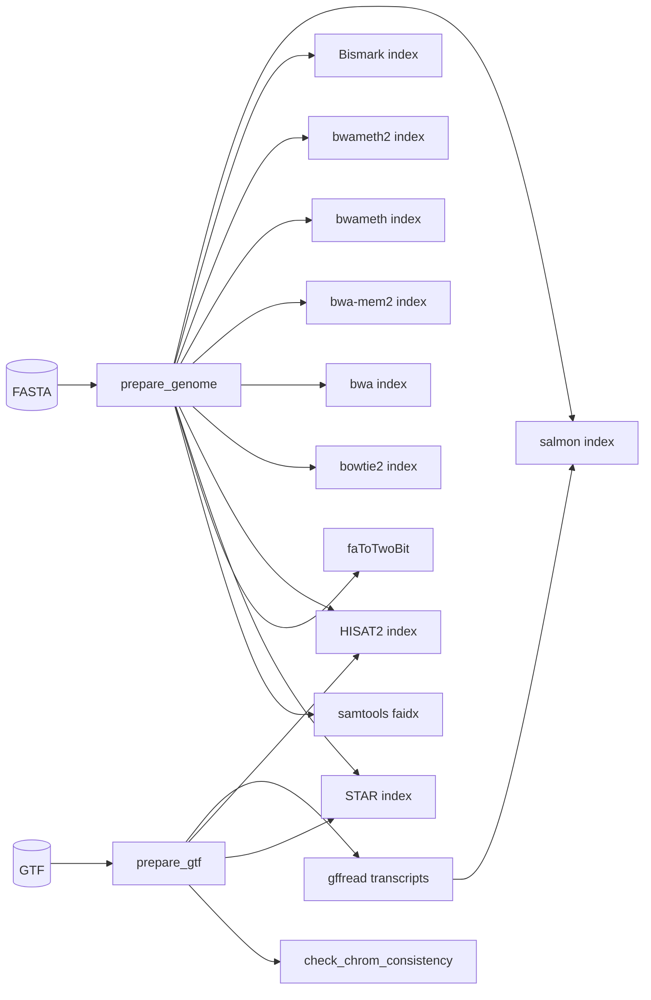

# aligner-index-builder

A [Snakemake](https://snakemake.readthedocs.io/) pipeline that builds a
complete set of aligner/indexer indices from a reference genome **FASTA**
(+ optional **GTF**) covering the same tools as snakePipes'
`createIndices`: STAR, HISAT2, bowtie2, bwa, bwa-mem2, bwa-meth
(bwameth/bwameth2), **Bismark** and salmon -- plus the `.fai` / `.2bit`
side products and a `gffread` transcriptome for decoy-aware salmon indexes.
Each index set lands in a lowercase index dir named after its tool
(`star_index/`, `bwa-mem2_index/`, ... -- see [What gets built](#what-gets-built)).

It is driven by a small CLI (`workflow/scripts/aligner-index-builder`) that
writes a run config and hands off to snakemake; tool versions are pinned
exactly. Everything runs out of a pre-built conda environment, distributed as
a GitHub Release asset -- no conda, no container runtime, no per-tool solves.

Companion of [TEtranscripts-pipe](https://github.com/altintasali/TEtranscripts-pipe)
(the RNA-seq quantification pipeline that consumes these index sets).

---

## Table of contents

- [Requirements](#requirements)
- [Install](#install)
- [Usage](#usage)
- [HPC / SLURM](#hpc--slurm)
- [What gets built](#what-gets-built)
- [Output layout](#output-layout)
- [Direct snakemake use](#direct-snakemake-use)
- [Config reference](#config-reference)
- [Architecture](#architecture)
- [Versioning & releases](#versioning--releases)
- [Caveats](#caveats)

## Requirements

- Linux **x86_64** for the pre-built environment (the release tarball is
  packed on GitHub Actions ubuntu runners). On other platforms create the
  environment yourself with conda (see below).
- The workflow itself needs only `bash`, `curl` and Python >= 3.9 for
  `install-env.sh` / the CLI.

## Install

### Option A -- pre-built environment (recommended)

```bash
git clone https://github.com/altintasali/aligner-index-builder.git
cd aligner-index-builder

./workflow/scripts/install-env.sh          # into $HOME/software/aligner-index-builder-env
source workflow/scripts/activate-env.sh    # activate in the current shell
```

`install-env.sh` downloads `aligner-index-builder-<version>-env.tar.gz` (+
`SHA256SUMS`) from the latest GitHub Release and unpacks it. Options:

- `-o PREFIX` -- install elsewhere (e.g. shared storage for a cluster)
- `-r vX.Y.Z` -- pin a specific release instead of latest
- `-f` -- overwrite even if `PREFIX` holds unrelated files

On SLURM compute nodes you can skip activation and just use the binaries:
`export PATH="$PREFIX/bin:$PATH"`.

### Option B -- conda (any platform)

```bash
conda env create -f workflow/environment.yaml
conda activate aligner-index-builder
```

## Usage

```bash
python workflow/scripts/aligner-index-builder \
  --fasta genome.fa --gtf genes.gtf \
  -o results/GRCh38 \
  --tools all \
  --cores 16
```

`--fasta` and `--gtf` may be local paths (plain, `.gz` or `.bz2` -- the
compression is sniffed, not assumed) or `http(s)://`, `ftp://`, `file://`
URLs. The CLI:

1. resolves local paths to absolute paths,
2. writes the run config to `<outdir>/<genome_name>.config.yaml`,
3. runs snakemake on the bundled `workflow/Snakefile`,
4. on success writes a manifest to `<outdir>/<genome_name>.yaml`.

A run always produces the FASTA (normalized + decompressed) with `.fai` and
`.2bit`, so you can hand those on to downstream pipelines.

### CLI options

| Option | Description |
| --- | --- |
| `--fasta PATH` | reference FASTA (required); local path or URL |
| `--gtf PATH` | gene annotation GTF (local path or URL); required for `star`, `hisat2`, `salmon`, which are otherwise skipped |
| `-o, --outdir DIR` | output directory, created if missing (required) |
| `--genome-name NAME` | name for the generated config + manifest (default: outdir basename) |
| `--tools TOOL...` | space- or comma-separated tools, or `all` (default) |
| `--sjdb-overhang N` | STAR splice-junction overhang, usually read length − 1 (default 100) |
| `--star-extra FLAGS` | extra `STAR --runMode genomeGenerate` flags (e.g. small-genome flags, see [Caveats](#caveats)) |
| `--salmon-kmer N` | salmon k-mer length (default 31) |
| `--cores N` | snakemake `--cores` (default 1) |
| `--slurm` | submit jobs to SLURM via the bundled profile `workflow/profiles/slurm` (see [HPC / SLURM](#hpc--slurm)) |
| `--dry-run` | write the config and print the snakemake plan, run nothing |
| `--keep-temp` | keep intermediates snakemake would delete |
| `--snakemake-options ARGS` | extra snakemake arguments, passed through verbatim (quoted) |
| `-v, --verbose` | print snakemake's shell commands |
| `--version` | print version |

## HPC / SLURM

The repo ships a bundled [Snakemake workflow profile](https://snakemake.readthedocs.io/en/stable/snakefiles/deployment.html)
for SLURM clusters (`workflow/profiles/slurm/config.yaml`). Pass `--slurm`
to the CLI and every job is submitted with `sbatch` instead of running
locally:

```bash
python workflow/scripts/aligner-index-builder \
  --fasta genome.fa --gtf genes.gtf \
  -o results/GRCh38 --tools all --slurm
```

The same profile works for direct snakemake runs (from the repo root):

```bash
snakemake --configfile results/GRCh38/GRCh38.config.yaml \
  --workflow-profile workflow/profiles/slurm --cores 64
snakemake --configfile results/GRCh38/GRCh38.config.yaml \
  --workflow-profile workflow/profiles/slurm -n   # dry-run, nothing submitted
```

How jobs are sized:

- Each rule's `threads`, `mem_mb` and `runtime` come from
  `workflow/default-config/resources.yaml`. For a real genome the defaults
  are middle-of-the-road; add a `resources:` block to the generated config
  (deep-merged over the defaults) to override e.g. STAR's 48 GB, or pass
  `--snakemake-options '--default-resources mem_mb=... runtime=...'`.
- The profile's own `default-resources` only cover rules that declare none.

Cluster specifics to edit in `workflow/profiles/slurm/config.yaml`:

- `slurm_account` (`icmm_dm`) and `qos` (`normal`) are the ICMM group values
  — replace them if you are on another cluster or in another group.
- `slurm_partition` is intentionally unset so `sbatch` uses the cluster's
  default partition; set it only if yours has no default.
- `latency-wait: 60` gives NFS time to show up after STAR/Bismark finish
  (they write `directory()` outputs); bump it if you ever see spurious
  "missing files after X seconds" failures.

Compute nodes need the tools: the workflow runs without `--sdm conda` (each
job inherits the submit environment), so the pre-built environment must be
visible there — prepend its `bin` to `PATH` on the nodes, e.g. with
`export PATH="$PREFIX/bin:$PATH"` (see [Install](#install)).

`--slurm` also works with `--dry-run` (validates the profile, submits
nothing). `sbatch` must be available wherever snakemake runs.

## What gets built

| Tool | Index dir | Marker file | Notes |
| --- | --- | --- | --- |
| STAR | `star_index/` | `SAindex` | needs GTF (`--sjdbGTFfile`, overhang from `--sjdb-overhang`) |
| HISAT2 | `hisat2_index/` | `genome.6.ht2` | needs GTF (splice sites + exons extracted with `hisat2_extract_splice_sites.py`/`_exons.py`) |
| bowtie2 | `bowtie2_index/` | `genome.rev.2.bt2` | FASTA only |
| bwa | `bwa_index/` | `genome.fa.sa` | FASTA only |
| bwa-mem2 | `bwa-mem2_index/` | `genome.fa.bwt.2bit.64` | FASTA only |
| bwa-meth | `bwa-meth_index/` | `genome.fa.bwameth.c2t.sa` | FASTA only; `bwameth.py index` |
| bwa-meth (mem2) | `bwa-meth2_index/` | `genome.fa.bwameth.c2t.bwt.2bit.64` | FASTA only; `bwameth.py index-mem2` |
| Bismark | `bismark_index/` | `Bisulfite_Genome/CT_conversion/BS_CT.1.bt2` | FASTA only; bowtie2-based (`bismark_genome_preparation --bowtie2`). Point `bismark --genome` at `bismark_index/` (the parent, not the `Bisulfite_Genome/` subdir) |
| salmon | `salmon_index/` | `seq.bin` | needs GTF; decoy-aware (transcripts via `gffread` + genome as decoys) |
| — | `genome_fasta/` | `genome.fa`, `genome.fa.fai`, `genome.2bit` | always; `samtools faidx` + `faToTwoBit` |
| — | `annotation/` | `genes.gtf`, `transcripts.fa` | when a GTF is given |

Tool version pins live in `workflow/default-config/versions.yaml` (also
mirrored into `workflow/environment.yaml`). Note: STAR 2.7.11b is the final
STAR release and pins `htslib < 1.23`, so `samtools` is pinned to `1.22.1` to
stay in the same environment.

## Output layout

```
results/GRCh38/
├── GRCh38.config.yaml          # run config (written by the CLI)
├── GRCh38.yaml                 # success manifest (written by the CLI)
├── genome_fasta/
│   ├── genome.fa               # normalized, uncompressed reference
│   ├── genome.fa.fai
│   └── genome.2bit
├── annotation/
│   ├── genes.gtf               # normalized annotation
│   └── transcripts.fa          # gffread transcriptome
├── star_index/
├── hisat2_index/
├── bowtie2_index/
├── bwa_index/
├── bwa-mem2_index/
├── bwa-meth_index/
├── bwa-meth2_index/
├── bismark_index/Bisulfite_Genome/
├── salmon_index/
└── pipeline_info/
    ├── logs/                   # per-rule logs + config_resolution.log
    └── benchmarks/             # per-rule timing/peak-memory tables
```

## Direct snakemake use

For debugging or scripting, generate the config with `--dry-run`, or write one
by hand (see `config/config.example.yaml`) and run:

```bash
snakemake --configfile results/GRCh38/GRCh38.config.yaml --cores N
```

The config chain loaded by `workflow/Snakefile` is:
`workflow/default-config/{versions,resources}.yaml` (built-in) &rarr; your run
config &rarr; optional `resources:` override block inside the run config.

## Config reference

| Key | Type | Default | Meaning |
| --- | --- | --- | --- |
| `genome_name` | string | outdir basename | name for config/manifest |
| `outdir` | string | — | output directory (required) |
| `fasta` | string | — | FASTA path or URL (required) |
| `gtf` | string/null | `null` | GTF path or URL; enables `star`/`hisat2`/`salmon` + the chromosome-consistency check |
| `tools` | array or `all` | — | which index sets to build (required) |
| `sjdb_overhang` | int | `100` | STAR `--sjdbOverhang` |
| `star_extra` | string | `""` | extra STAR genomeGenerate flags |
| `salmon_kmer` | int | `31` | salmon `-k` |
| `resources` | map | — | per-rule `{threads, mem_mb, runtime}` overrides (deep-merged over `default-config/resources.yaml`) |

## Architecture

```
aligner-index-builder (CLI)
   └─ writes <outdir>/<name>.config.yaml
       └─ snakemake -s workflow/Snakefile --configfile <config>
           ├─ default-config/{versions,resources}.yaml  (built-in defaults)
           ├─ rules/common.smk  (config validation, paths, per-tool envs)
           └─ rules/index.smk   (one rule per index)
               ├─ fetch_reference.py (download/copy + gzip/bz2 sniff-decompress)
               └─ check_chroms.py   (FASTA-vs-GTF contig consistency gate)
```



Per-tool conda env files are generated into `workflow/envs/generated/` at
parse time from `versions.yaml`; they're used only with
`snakemake --sdm conda`. The pre-built env already ships the same tools, so
plain `snakemake` runs use the activated environment directly.

## Versioning & releases

- `VERSION` holds the project version; `versions.yaml` holds tool versions.
- Releases are tagged `vX.Y.Z`. Pushing a tag triggers
  `.github/workflows/release-env.yml`, which conda-packs the environment,
  splits it into `<2 GiB` parts if needed, writes `SHA256SUMS`, and creates
  the release. `install-env.sh` resolves the latest release (API-free: the
  releases Atom feed + the shipped `SHA256SUMS`; `AIB_INSTALL_ORIGIN`
  overrides the origin host for mirrors/tests).
- CI (`.github/workflows/ci.yml`) builds every index set from the tiny
  committed fixture (`.tests/`) and runs the negative edge-case guards.

## Caveats

- **STAR on small genomes**: STAR aborts `genomeGenerate` on very small
  references unless told otherwise. For the ~120 kb CI fixture the flag is
  `--star-extra "--genomeSAindexNbases 7 --genomeChrBinNbits 16"` (printed by
  `.tests/generate_test_data.py`); real chromosomes are unaffected.
- **STAR exit code**: STAR has a long-standing benign exit-time crash (a
  segfault *after* all index files are written). `star_index` treats a
  non-zero exit as success if the core files actually landed on disk.
- **macOS**: the pre-built env is Linux x86_64 only. Build it locally with
  conda (Option B) or run on CI/linux.
- **Reproducibility**: tool builds are deterministic for a given reference;
  outputs land in `outdir` and are gitignored, so the repo stays a clean
  project and `git pull` never conflicts with generated data.
